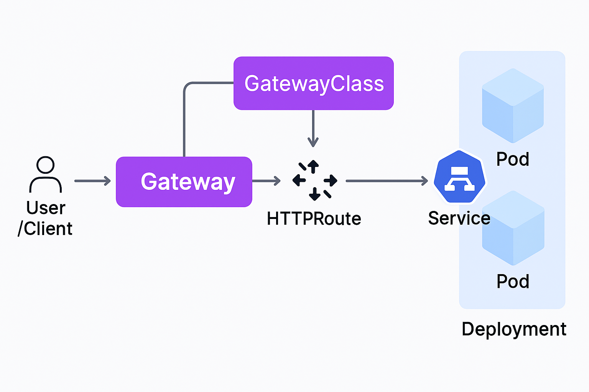

# WIP

### Why we need K8S Gateway API
- Limitations of **Ingress**:
  - No support for multi-tenancy
    - All teams share the same Ingress config, making it hard to isolate concerns.
  - No namespace isolation
    - Ingress rules are cluster-wide and do not enforce boundaries between namespaces.
  - No fine-grained RBAC for features
    - Anyone with access to Ingress can modify routing, SSL, etc., without granular control.
  - No resource isolation
    - You can't allocate or limit gateway resources per team or namespace.

- 

### K8S Gateway API
- A modern, more powerful **alternative** to the traditional **Ingress**.

- Designed to support **advanced routing**, **role separation**, and **multi-tenancy**.

- Works with both **north-south** (external) and **east-west** (internal) traffic.

- Built with extensibility and better CRD structure in mind.

- Supported by many ingress controllers like **NGINX**, **Istio**, and **Contour**.

### How Gateway API Works

- **User/Client** sends an HTTP request to the cluster.

- The request first hits the **Gateway**, which is like a **load balancer**.

- That **Gateway** uses rules defined in an **HTTPRoute** to decide where to send the traffic.

- The **HTTPRoute** sends the request to the correct **Service**.

- The **Service** forwards the request to the correct **Pods** (your actual application).

### Kubernetes Traffic Flow

- **Northbound**: Traffic going from inside the cluster to the outside world
- **Southbound**: Traffic coming from the Internet into the Kubernetes cluster
- **East/West**: Traffic flowing within the cluster, usually between **services** or **pods**

### Demo

- [Demo](./demo/README.md)

### References
(1*) https://gateway-api-inference-extension.sigs.k8s.io/

(2*) [Gateway API Explained: The Future of Kubernetes Networking](https://www.youtube.com/watch?v=xaZ87iSvMAI)

(3*) [Kubernetes Gateway API - Tech Tutorials with Piyush](https://www.youtube.com/watch?v=2lcx74HUz1U)

(4*) https://gateway-api.sigs.k8s.io/concepts/api-overview/

(5*) https://github.com/kubernetes-sigs/gateway-api
